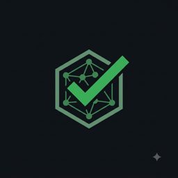

<p align="center">
  <a href="https://meshtest.dev">
    
  </a>
</p>

<h1 align="center">MeshTest — Issue Tracker</h1>

<p align="center">
  <em>Public inbox for bugs, feature requests, and questions about <code>@meshtest/cli</code> and <code>@meshtest/server</code>.</em>
</p>

<p align="center">
  <a href="https://www.npmjs.com/package/@meshtest/cli"></a>
  <a href="https://www.npmjs.com/package/@meshtest/server"></a>
  <a href="https://meshtest.dev"></a>
</p>

MeshTest is a CLI + MCP server for live API regression testing. Import a Postman collection or OpenAPI spec, and one command later you have a runnable test suite with auth auto-detected, baseline drift detection, and an MCP server so AI agents can drive it. See **[meshtest.dev](https://meshtest.dev)** for the full pitch and **[meshtest.dev/docs](https://meshtest.dev/docs)** for the docs.

The main MeshTest source code is proprietary and lives in a private repository. **This repo exists solely so users can file issues.**

## What belongs here

- Bugs you hit using `@meshtest/cli` or `@meshtest/server`
- Feature requests and enhancement ideas
- Questions about how to do something with MeshTest that the docs don't answer
- Feedback about the docs, the CLI UX, error messages, examples, etc.

## What doesn't

- **Source code contributions.** The source lives in a private repo. There is no PR path from this tracker. If you have a fix you'd like to see land, describe it in an issue — I'll evaluate and, if it lands, credit you in the release notes.
- **Security issues.** These should never be filed publicly. See [Security issues](#security-issues) below.
- **General MCP-protocol questions unrelated to MeshTest.** See the [Model Context Protocol spec](https://modelcontextprotocol.io/) instead.

## Before filing

A few things that turn a low-signal issue into a high-signal one:

1. **Check you're on the latest version.** Many issues are already fixed on `latest`:
   ```bash
   meshtest --version                              # or npx @meshtest/cli --version
   npm view @meshtest/cli version                  # latest published
   npm view @meshtest/server version               # latest published
   ```
2. **Search [existing issues](https://github.com/developerKumar/meshtest-issues-tracker/issues?q=is%3Aissue).** Both open and closed.
3. **Prepare a minimal reproduction.** Distill your setup down to the smallest manifest, config, or command line that still shows the bug. Under 20 lines of YAML if you can.
4. **Include the exact error.** Copy the stderr output verbatim inside a fenced code block — not a screenshot, not a paraphrase.

## Filing a bug

The **[New Issue](https://github.com/developerKumar/meshtest-issues-tracker/issues/new/choose)** page has a *Bug report* template that will ask you for the fields below. Fill them all in if possible — every missing field is one round-trip of back-and-forth.

- **Package + version** — `@meshtest/cli` or `@meshtest/server`, and the exact version you're running (`meshtest --version` / `meshtest-server --version`).
- **OS + Node version** — `node --version`, plus macOS / Linux distro / Windows.
- **Install method** — global `npm install -g`, `npx`, or project-local `devDependency`.
- **Minimal manifest / config** — inline in a fenced code block.
- **Command you ran** — the exact `meshtest ...` invocation, including flags.
- **Expected behavior** — one sentence.
- **Actual behavior** — one sentence plus the actual stderr / exit code.
- **`MESHTEST_TELEMETRY_DEBUG=1` output** *(optional, only if the bug is telemetry-related)* — set that env var and re-run; the outgoing PostHog payload will be printed to stderr.

## Filing a feature request

Use the *Feature request* template. Two things I care about most:

1. **What problem does this solve?** Describe the real workflow you're trying to enable — not the API you'd like to see. "I want to run smoke tests only" is more useful than "add a `--smoke` flag".
2. **What have you tried?** Existing MeshTest features that get close, or how other tools (Newman, k6, Postman, Bruno) handle it. If you know of prior art, link it.

Not every feature request will land. Feature requests that get built are almost always the ones that describe a real end-to-end workflow rather than an isolated API tweak.

## Filing a question

Use the *Question* template. Include:

1. **What you're trying to do** — the end goal, not just the current stuck point.
2. **What you've already tried** — commands run, docs pages read, guesses attempted.
3. **What's confusing** — did the docs suggest something that didn't work? Was an error message unhelpful? Missing example?

Questions with clear context often turn into docs improvements — so filing a good question directly makes MeshTest better for the next person.

## Security issues

**Do not file security issues here.** Instead, email **[mukulk133@gmail.com](mailto:mukulk133@gmail.com)** with:

- A clear description of the vulnerability
- Steps to reproduce
- The affected version(s)
- Impact assessment (what could an attacker do?)

I aim to acknowledge security reports within 72 hours and coordinate a fix + release before public disclosure. If a reported issue is confirmed, credit is given in the release notes unless you'd prefer to stay anonymous.

## Response expectations

MeshTest is maintained by a single person on nights and weekends. Realistic expectations:

- **Bugs with a clear repro** — typically triaged within a few days, patched in the next release.
- **Feature requests** — evaluated, but not all will land. Expect a substantive response within a week; expect the actual work to line up with the [`LAUNCH.md`](https://github.com/developerKumar/meshtest) roadmap and available time.
- **Questions** — usually the fastest, since they don't need a code change.
- **Security issues** — acknowledged within 72 hours (see above).

If an issue sits without a response for more than two weeks, feel free to bump it with a comment.

## About MeshTest

- **Product**: [meshtest.dev](https://meshtest.dev)
- **Docs**: [meshtest.dev/docs](https://meshtest.dev/docs)
- **CLI on npm**: [`@meshtest/cli`](https://www.npmjs.com/package/@meshtest/cli)
- **MCP server on npm**: [`@meshtest/server`](https://www.npmjs.com/package/@meshtest/server)
- **License**: Proprietary with a broad free-use grant. Both npm packages ship a `LICENSE` file with the full text.

Maintainer: **Mukul Kumar** — [github.com/developerKumar](https://github.com/developerKumar)
